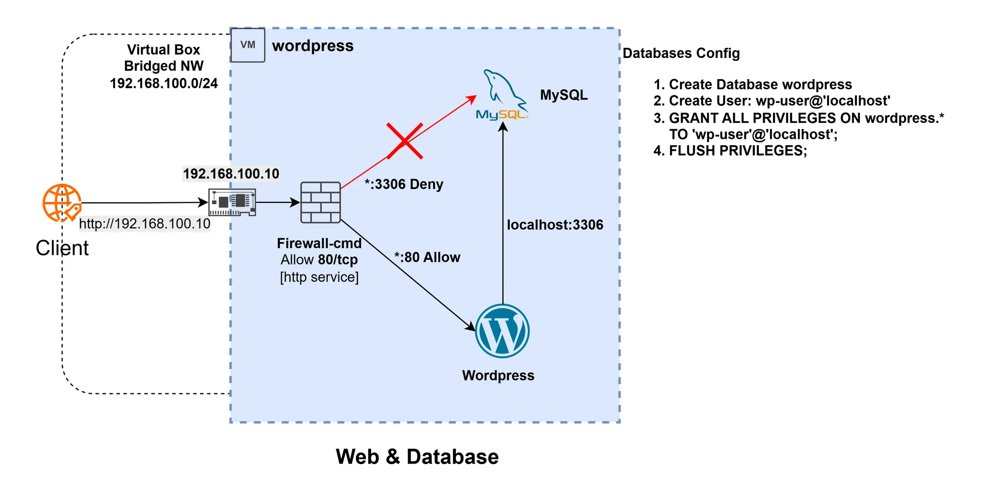

# 1. 단일서버 아키텍처
### [단일서버 아키텍처 상세](https://blog.wooks-space.me/1-1de07373030f811e9940c6055bac6791?pvs=74)

### 시스템 구성 결과물


### 프로젝트 실행 방법
1. vagrant 및 virtual box 설치
2. git clone `https://github.com/shinooks/wordpress-study`
2. 작업 디렉터리를 `1. 단일서버 아키텍처`로 이동
3. Vagrantfile에서 `HOST_IF`의 인터페이스명을 인터넷이 가능한 인터페이스로 지정 (ex. ens..., wlp... 등)
4. `vagrant up` 명령어로 가상머신 프로비저닝

```
# -*- mode: ruby -*-
# vi: set ft=ruby :
vm_image = "generic/rocky9"

HOST_IF = "wlp2s0"

DB_NAME = "wordpress"
DB_USER = "wp-user"
DB_PASSWD = "P@ssW0rd"
DB_HOST = "localhost"

WP_CONFIG_FILE="/var/www/html/wordpress/wp-config.php"
WP_IP = "localhost"

# 공통 설정 및 리포지터리 업데이트
common_script = <<-SCRIPT
echo "root" | sudo passwd --stdin root
systemctl reload sshd
echo 0. 레포지터리 업데이트...
# time sudo dnf update -y
SCRIPT

# WAS 설치 스크립트
was_install_script = <<-SCRIPT

echo 1. 패키지 설치
time (
  dnf install httpd php php-mysqlnd mysql-server -y
  systemctl enable --now httpd
  systemctl enable --now mysqld
)
 
echo 2. 방화벽 허용
firewall-cmd --add-service=http --add-service=https --add-service=mysql --permanent
firewall-cmd --reload

echo 3. Wordpress 소스 코드 설치
time (
wget https://wordpress.org/latest.tar.gz -O wordpress.tar.gz
tar -xvf wordpress.tar.gz -C /var/www/html/
cp /var/www/html/wordpress/wp-config-sample.php /var/www/html/wordpress/wp-config.php
)

echo 4. apache 가상 호스팅 구성
sudo tee -a /etc/httpd/conf.d/wordpress.conf<<EOF
<VirtualHost _default_:80>
    Servername cccr.com
    DocumentRoot /var/www/html/wordpress
    
    <Directory "/var/www/html/wordpress">
        AllowOverride ALL
    </Directory>
</VirtualHost>
EOF
sudo systemctl enable httpd --now

echo 5. 데이터베이스 서버 구성
sudo mysql -u root<<EOF
CREATE DATABASE IF NOT EXISTS #{DB_NAME};
CREATE USER IF NOT EXISTS '#{DB_USER}'@'#{WP_IP}' IDENTIFIED BY '#{DB_PASSWD}';
GRANT ALL PRIVILEGES ON #{DB_NAME}.* TO '#{DB_USER}'@'#{WP_IP}';
FLUSH PRIVILEGES;
EOF

echo 6. 워드프레스 설정 변경
sed -i "s/define( 'DB_NAME', 'database_name_here' );/define( 'DB_NAME', '#{DB_NAME}' );/" "#{WP_CONFIG_FILE}"
sed -i "s/define( 'DB_USER', 'username_here' );/define( 'DB_USER', '#{DB_USER}' );/" "#{WP_CONFIG_FILE}"
sed -i "s/define( 'DB_PASSWORD', 'password_here' );/define( 'DB_PASSWORD', '#{DB_PASSWD}' );/" "#{WP_CONFIG_FILE}"
# sed -i "s/define( 'DB_HOST', 'localhost' );/define( 'DB_HOST', '#{DB_HOST}' );/" "#{WP_CONFIG_FILE}"

systemctl restart httpd
SCRIPT

Vagrant.configure("2") do |config|
  config.vm.synced_folder ".", "/vagrant", disabled: true
  config.vm.network "public_network", bridge: "#{host_if}"
  config.vm.define "wordpress" do |node|
    node.vm.box = vm_image
    node.vm.provider "virtualbox" do |vb|
      vb.name = "wordpress"
      vb.cpus = 2
      vb.memory = 2048
    end

    node.vm.hostname = "wordpress"
    node.vm.provision "shell", inline: common_script
    node.vm.provision "shell", inline: was_install_script
  end
end

```
### 실행 결과 확인
1. 브라우저에서 할당받은 WP 서버의 IP로 접속
2. `curl -I http:// <할당받은 WP 서버의 IP>`
    --
    ```
    HTTP/1.1 302 Found
    Date: Fri, 18 Apr 2025 07:42:36 GMT
    Server: Apache/2.4.62 (Rocky Linux)
    X-Powered-By: PHP/8.0.30
    Expires: Wed, 11 Jan 1984 05:00:00 GMT
    Cache-Control: no-cache, must-revalidate, max-age=0, no-store, private
    X-Redirect-By: WordPress
    Location: http://localhost/wp-admin/install.php <- wordpress 초기 구성 페이지
    Content-Type: text/html; charset=UTF-8
    ```

### 특이 사항 및 트러블 슈팅
1. 설정 과정에서 DB 연결에 실패했던 사례
    - 확인 결과 DB 생성 시 수동으로 생성하는 과정에서 사용자의 접속 위치를 localhost가 아닌 IP로 지정
    - 해당 계정을 제거하고 **`'wp-user'@'localhost'`**으로 새로 구성하여 해결
        
        ```bash
        SHOW GRANTS FOR 'wp-user'@'localhost';
        ERROR 1141 (42000): There is no such grant defined for user 'wp-user' on host 'localhost'
        mysql> SHOW GRANTS FOR 'wp-user'@'192.168.100.10';
        +--------------------------------------------------------------------+
        | Grants for wp-user@192.168.100.10                                   |
        +--------------------------------------------------------------------+
        | GRANT USAGE ON *.* TO `wp-user`@`192.168.100.10`                    |
        | GRANT ALL PRIVILEGES ON `wordpress`.* TO `wp-user`@`192.168.100.10` |
        +--------------------------------------------------------------------+
        
        ```
        
    - wordpress의 설정 상에서는 DB HOST 정보가 localhost가 되어 있어 DB 연결이 되지 않았음.
2. 서비스 초기 구성에서 리포지터리 업데이트의 중요성이 크지 않아 과정을 생략
    - 초기 구성 시 패키지 전체 업데이트를 포함할 경우 VM 초기 생성 시간이 300% 증가하는 것을 확인
        - 미포함시: 3분 이내 / 포함 시: 9분 이상
        
        ```bash
        wordpress: 레포지터리 Update...
        						...
        wordpress: real     6m38.827s
        wordpress: user     3m58.054s
        wordpress: sys      0m58.280s
        ```
        